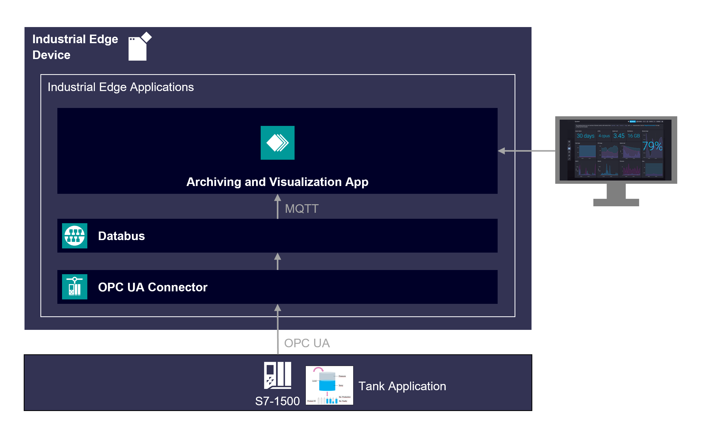

# Archiving & Visualization Demo

Archiving and Visualization Panel demo application for Industrial Edge

- [Archiving & Visualization Demo](#archiving--visualization-demo)
  - [Description](#description)
    - [Overview](#overview)
    - [General Task](#general-task)
  - [Requirements](#requirements)
    - [Components](#components)
    - [Helpful tools](#helpful-tools)
    - [TIA Project](#tia-project)
  - [Prerequisite](#prerequisite)
  - [Installation](#installation)
  - [Usage](#usage)
    - [Information](#information)
  - [Documentation](#documentation)
  - [Contribution](#contribution)
  - [License & Legal Information](#license--legal-information)

## Description

### Overview

The Industrial Edge Application "Archiving & Visualization Demo" is based on a bottle filling process application from which data values are collected, stored in an Influxdb database and visualized with a Grafana dashboard.

### General Task

The Industrial Edge Application "Archiving & Visualization Demo" collects data from an S7-1500 PLC using the S7 Connector System Application. The collected data is automatically published to the IE Databus which is an internal MQTT broker of the Edge Runtime. The "Archiving & Visualization Demo" Application uses an MQTT Client (Datacollector) to subscribe to the IE Databus and write these values into an Influx-Database. The time series of the collected data can then be plotted with grafana.

## Requirements

### Components

- OS: Windows or Linux
- Docker minimum V18.09
- Docker Compose V2.0 – V2.4
- Industrial Edge App Publisher (IEAP) > V1.0.8
- Industrial Edge Management (IEM) > V1.0.10
  - S7 Connector > V1.0.22
  - S7 Connector Configurator > V1.0.9
  - IE Databus > V1.0.11
  - IE Databus Configurator > V1.0.44
- Industrial Edge Device (IED) > V1.0.0-43
- TIA Portal V16
- PLC: CPU 1511 FW 2.8.3

### Helpful tools

- Any development environment (e.g. Visual Studio Code, Eclipse, …)
- Docker Extension for your development environment e.g. Visual Studio Code Extension

### TIA Project

The used TIA Portal project can be found in the [miscellenous repository](https://github.com/industrial-edge/miscellenous) under the following name and is also used for several further application examples:

- [tia-tank-application-20201028.7z](https://github.com/industrial-edge/miscellenous/blob/main/tia-tank-application-20201028.7z)

## Prerequisite

Use SIMATIC S7 Connector in bulk publish mode to collect datapoints from the Demo project "Tank Application". Name the PLC "PLC_1" and select following Datapoints using the Browse functionality:
- GDB_signals_tankSignals_actLevel (Read/100ms)
- GDB_signals_tankSignals_actTemperature (Read/100ms)
- GDB_process_numberProdued (Read/100ms)
- GDB_process_numberFaulty (Read/100ms)
- GDB_hmiSignals_HMI_Nextbottle (Read&Write/100ms)

The IE Databus is configured with one topic:
ie/#
username: edge
password: edge

## Installation

For a Step-by-Step guide on how to install this Industrial Edge Application, follow the **[installation instructions](docs/installation.md)**

## Usage

### Information

> :warning: This application exposes accessible API endpoints protected by username and password. Protect your Industrial Edge Device from unauthorized access and don't share your API username and password. This application is only a How To and is not designed to be used in a production enviroment.

## Documentation

- You can find further documentation and help in the following links
  - [Industrial Edge Hub](https://iehub.eu1.edge.siemens.cloud/#/documentation)
  - [Industrial Edge Forum](https://www.siemens.com/industrial-edge-forum)
  - [Industrial Edge landing page](https://new.siemens.com/global/en/products/automation/topic-areas/industrial-edge/simatic-edge.html)
  
## Contribution

Thanks for your interest in contributing. Anybody is free to report bugs, unclear documentation, and other problems regarding this repository in the Issues section or, even better, is free to propose any changes to this repository using Merge Requests.

## License & Legal Information

Please read the [Legal information](LICENSE.md).
