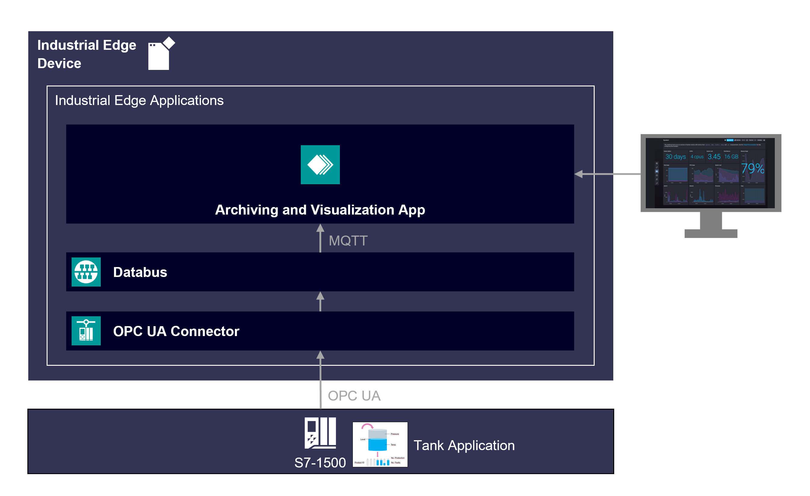

# Archiving & Visualization Demo

Archiving and visualization demo application for Industrial Edge

- [Archiving \& Visualization Demo](#archiving--visualization-demo)
  - [Description](#description)
    - [Overview](#overview)
    - [General Task](#general-task)
  - [Requirements](#requirements)
    - [Used Components](#used-components)
    - [TIA Project](#tia-project)
    - [Helpful tools](#helpful-tools)
  - [Prerequisite](#prerequisite)
  - [Installation](#installation)
  - [Documentation](#documentation)
  - [Contribution](#contribution)
  - [License and Legal Information](#license-and-legal-information)
  - [Disclaimer](#disclaimer)

## Description

### Overview

The Industrial Edge Application "Archiving & Visualization Demo" is based on a bottle filling process application from which data values are collected, stored in an InfluxDB database and visualized in a InfluxDB dashboard.

### General Task

The Industrial Edge Application "Archiving & Visualization" collects data from an S7-1500 PLC using the OPC UA Connector application. The collected data is automatically published to the Databus which is an internal MQTT broker of the Edge Runtime. The Application uses an MQTT Client (data-collector) to subscribe to the Databus and write these values into an InfluxDB database. The time series of the collected data can then be plotted with InfluxDB dashboards.

You can find the further information about the application [here](docs/overview.md)

## Requirements

### Used Components

- OS: Windows or Linux
- Docker V28.4.0
- Docker Compose V2.39.4
- Industrial Edge App Publisher (IEAP) &geq; V1.22.10
- Industrial Edge Management Virtual (IEMV) V2.5
  - Edge Apps
    - OPC UA Connector V2.4.2
    - Databus V3.2.1
    - Common import Converter V3.0.0
  - IEM Apps
    - Databus Configurator v3.2.2
    - Common Connector Configurator v2.0.1
- Industrial Edge Virtual Device (IEvD) V1.24.2.1-A
- TIA Portal &geq; V19
- PLC: CPU 1512

### TIA Project

The used TIA Portal project can be found in the [miscellaneous repository](https://github.com/industrial-edge/miscellaneous) in the tank application folder and is also used for several further application examples:

- [Tia Tank Application](https://github.com/industrial-edge/miscellaneous/tree/main/tank%20application)

### Helpful tools

- Any development environment (e.g. Visual Studio Code, Eclipse, …)
- Docker Extension for your development environment e.g. Visual Studio Code Extension

## Prerequisite
Use OPC UA Connector in bulk publish mode to collect datapoints from the Application example "Tank Application". Name the Data Source "Tank" and select following Datapoints using the Browse functionality:

* GDB.signals.tankSignals.actLevel (Read/100ms)
* GDB.signals.tankSignals.actTemperature (Read/100ms)
* GDB.process.numberProduced (Read/100ms)
* GDB.process.numberFaulty (Read/100ms)
* GDB.hmiSignals.HMI_Nextbottle (Read&Write/100ms)

The Databus is configured with one topic: `ie/#` username: `edge` password: `edge`

  

    In case of browse timeout you can also add the tags manually
<small><i>Click to show/collapse.</i></small>
  

* `n=3;s="GDB"."signals"."tankSignals"."actLevel"`
* `n=3;s="GDB"."signals"."tankSignals"."actTemperature"`  
* `n=3;s="GDB"."process"."numberProduced"` 
* `n=3;s="GDB"."process"."numberFaulty"`
* `n=3;s="GDB"."hmiSignals"."HMI"."NextBottle"`

## Installation

You can find the further information about the following steps in the [docs](docs/installation.md)

- [Build application](docs/installation.md#build-application)
- [Upload application to Industrial Edge Management](docs/installation.md#upload-application-to-industrial-edge-management)
- [Configure and install application to Industrial Edge Device](docs/installation.md#install-application-on-industrial-edge-device)

## Documentation
 
- You can find further documentation and help in the following links
  - [Industrial Edge Hub](https://iehub.eu1.edge.siemens.cloud/#/documentation)
  - [Industrial Edge Forum](https://forum.mendix.com/link/space/industrial-edge)
  - [Industrial Edge landing page](https://new.siemens.com/global/en/products/automation/topic-areas/industrial-edge/simatic-edge.html)
  - [Industrial Edge GitHub page](https://github.com/industrial-edge)
  - [Industrial Edge documentation page](https://docs.eu1.edge.siemens.cloud/index.html)
  
## Contribution

Thank you for your interest in contributing. Anybody is free to report bugs, unclear documentation, and other problems regarding this repository in the Issues section.
Additionally everybody is free to propose any changes to this repository using Pull Requests.

If you haven't previously signed the [Siemens Contributor License Agreement](https://cla-assistant.io/industrial-edge/) (CLA), the system will automatically prompt you to do so when you submit your Pull Request. This can be conveniently done through the CLA Assistant's online platform. Once the CLA is signed, your Pull Request will automatically be cleared and made ready for merging if all other test stages succeed.

## License and Legal Information

Please read the [Legal information](LICENSE.txt).

## Disclaimer

IMPORTANT - PLEASE READ CAREFULLY:

This documentation describes how you can download and set up containers which consist of or contain third-party software. By following this documentation you agree that using such third-party software is done at your own discretion and risk. No advice or information, whether oral or written, obtained by you from us or from this documentation shall create any warranty for the third-party software. Additionally, by following these descriptions or using the contents of this documentation, you agree that you are responsible for complying with all third party licenses applicable to such third-party software. All product names, logos, and brands are property of their respective owners. All third-party company, product and service names used in this documentation are for identification purposes only. Use of these names, logos, and brands does not imply endorsement.
