## Build Application
1. Clone this repository

   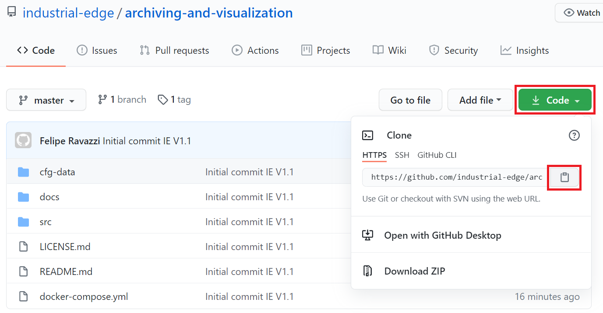

   STRG+SHIFT+P in VSCode:

   
   
2. Enter application folder and build the application using the docker-compose build command:

    ```bash
    docker-compose build
    ```

3. Create new Project in the Industrial Edge Management under **"My Projects" -> "Create Project"**
   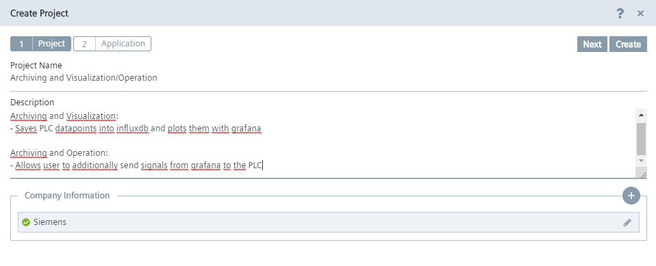

4. Create an Application and specify the required information:
   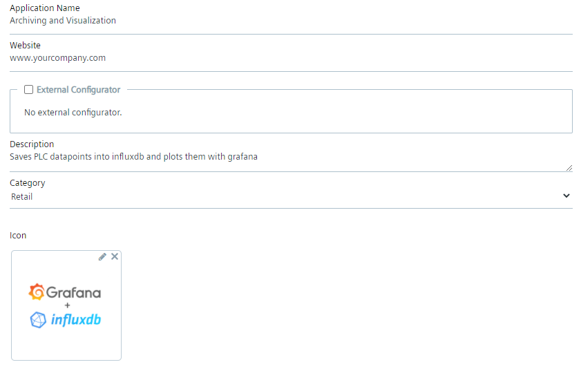

5. Go-To IE Publisher, and select newly created App. Then select **"+Configurations"**
   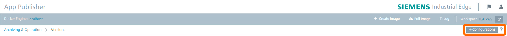

6. Add a new Configuration and enter all required fields:
   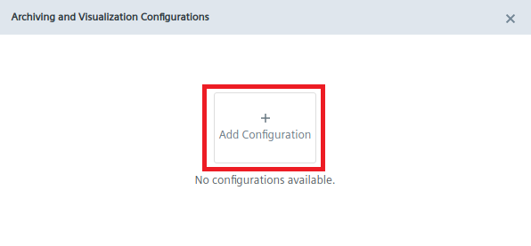

   ```txt
   Display Name: Configuration
   Description: JSONForms Configuration
   Host Path: ./cfg-data/
   Add Template
    - Name: JSONForms
    - Description: JSONForms Configuration
    - JSON Schema: set checkbox
   ```
   In the final step, add the file **/datacollector/config/config.json** as a template file. 
   This template was creared with JSON Schema. To find out how to create your own template check out the IEM Operations Documentation.

   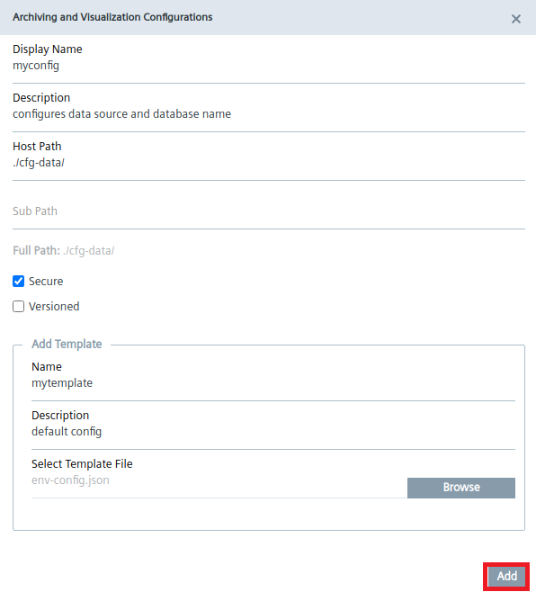

   **Hint:** If no config file is selected during App installation, then the default values from **datacollector/config/env-config.json** are taken:

   ```txt
   {
      "MQTT": {
         "HOST": "ie-databus",
         "PORT": "1883",
         "USERNAME": "edge",
         "PASSWORD": "edge",
         "DEFAULT_TOPIC_NAME": "ie/d/j/simatic/v1/s7c1/dp/",
         "DEFAULT_METADATA_TOPIC_NAME": "ie/m/j/simatic/v1/s7c1/dp",
         "DATA_SOURCE_NAME": "PLC_1"
      },
      "INFLUXDB": {
         "HOST": "influxdb",
         "PORT": "8086",
         "USERNAME": "root",
         "PASSWORD": "root",
         "MEASUREMENT": "edge",
         "DATABASE": "databus_values"
      }
   }
   ```

7. Now select **"Add New Version"** and select **docker-compose v2.4**
   
   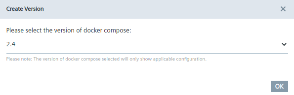

8. In the top right corner select **"Import YAML file"** and select the **docker-compose.yml** file from your directory. Click **"OK"**. The warnings can be ignored.

9. **Optional:** Configure a reverse proxy in the "Network"-section of the grafana service: 

   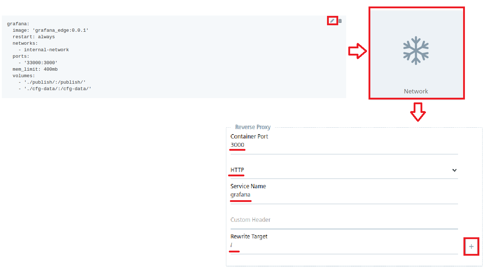

   **Notice:** Port exposure must be removed in this case. To do this, simply select the trash-icon in the very bottom.

   **Save** changes.

10. Select **"Review"** then **"Validate & Create"** on the top right. Then select **"Create"**
    
    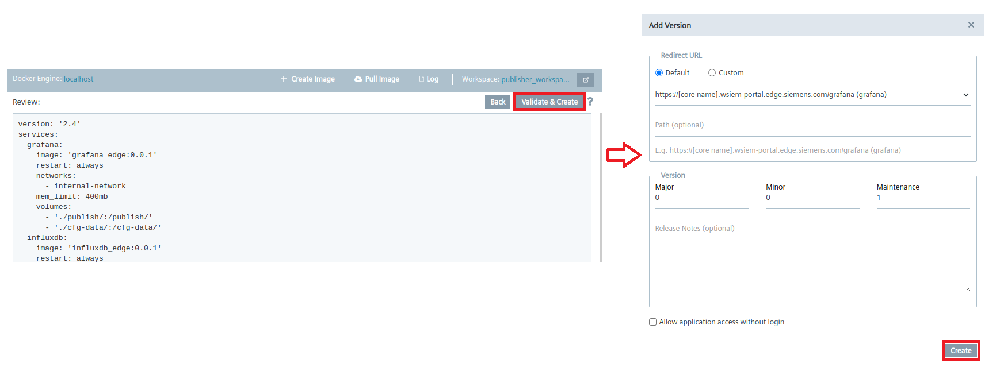

11. Afterwards, select **"Start Upload"**.

      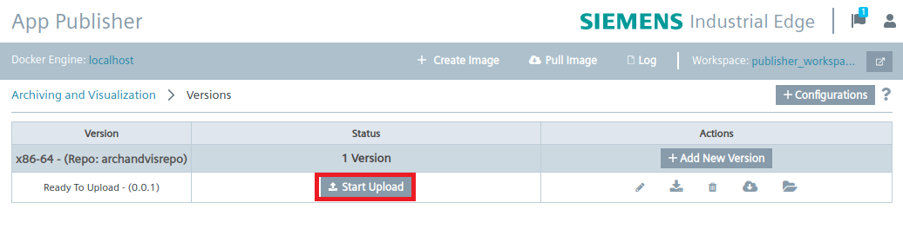

## Install Application on Edge Device


12. Once the App is successfully uploaded to your IEM, Go-To **"My Projects"** and select the newly created Application. Then select **"Install"**

      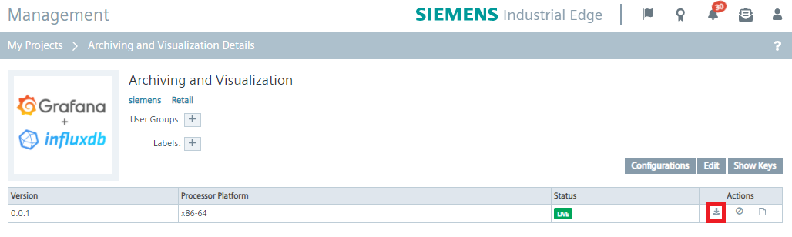

13. In the **"Configurations"**-Tab, select the green checkmark and fill out the required information: 


      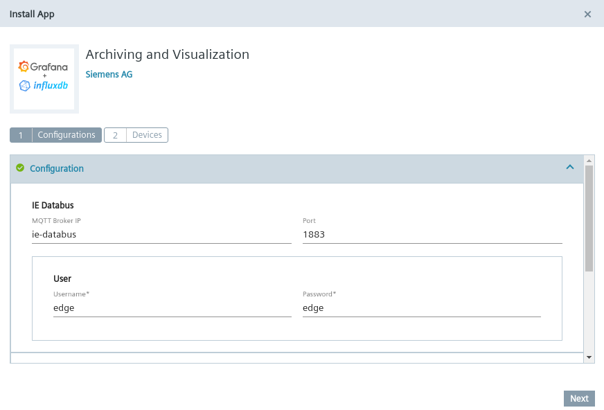

      ```txt
      MQTT Broker IP: ie-databus 
      Port: 1883
      User: edge
      Password: edge
      Data Source Name: PLC_1
      InfluxDB IP: influxdb
      Database name: databus_values
      ```

14. Install the Application on your Edge Device. 

15. Open Grafana and login with following credentials, afterwards change password if needed:
    
    username: **admin**
    password: **admin**

    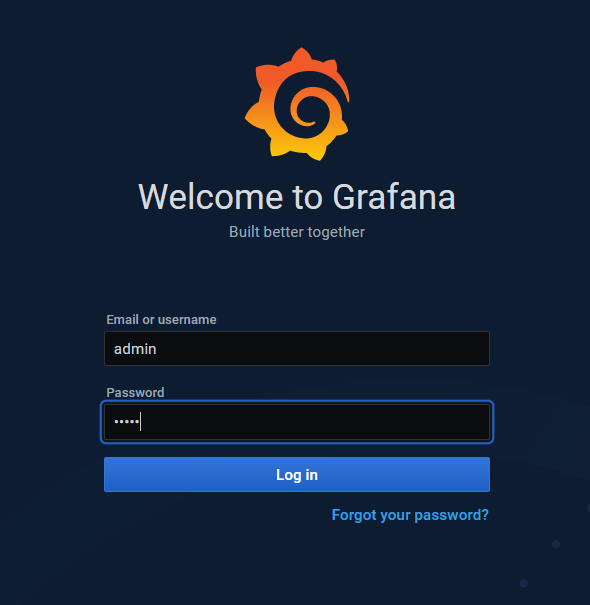
    
16. Go to **Data Sources** 
    
    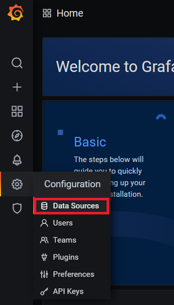

17. add a new Datasource (InfluxDB), and enter the address **influxdb:8086**.

    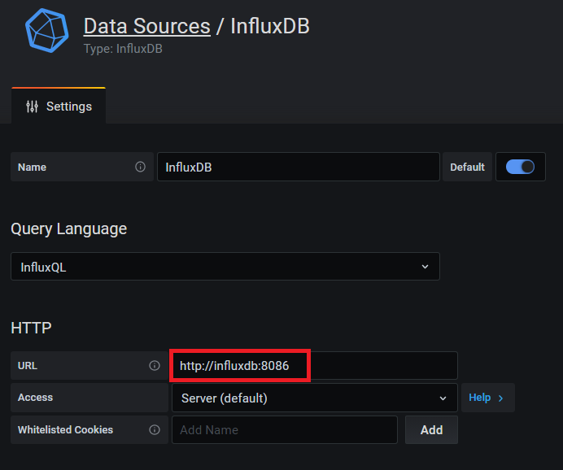

18. In the bottom of the Datasource configuration, enter the database name **databus_values**. Then select **Save & Test**.

    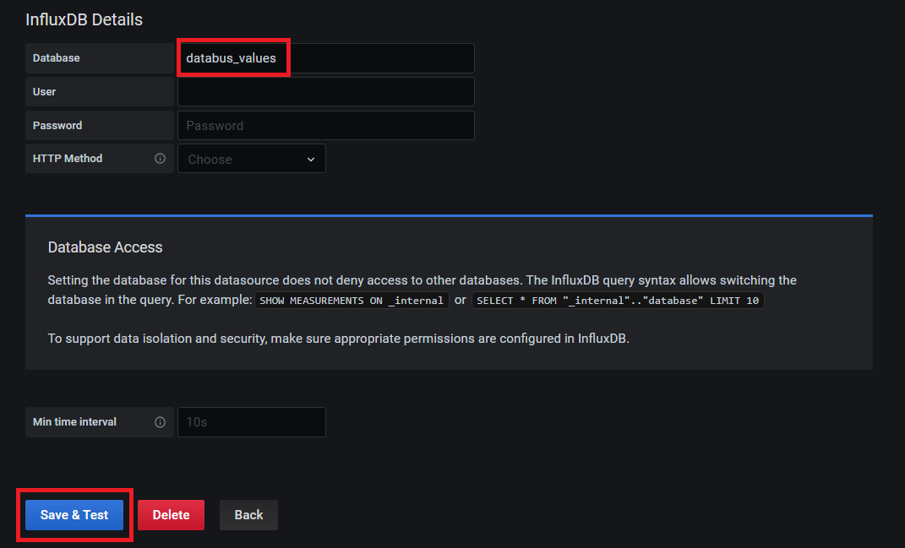

    You should receive a notification "Data source is working". If not, you might have selected a different name in the config file.

19. Make sure the S7-Connector Project is started and your PLC is in Start Mode. Set "GDB".hmiSignals.HMI_Start to TRUE on your PLC. 

20. In Grafana, Add a new Panel in the Dashboard section. You will be able to select and configure your Datapoints.

   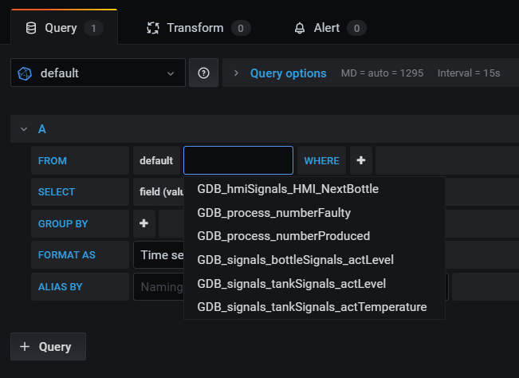

21. Select the values you would like to plot and remove the **"Group By" options** and the **"SELECT mean(value)"** option.

   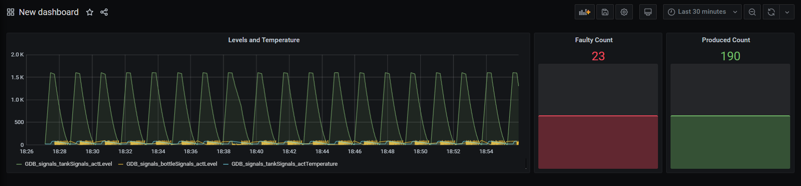

22. When finished with the dashboard, save it, then select settings in the top section to export it as a JSON-file. 

   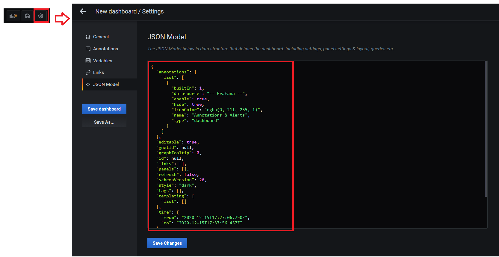

  Save its content as **"operation-panel.json"**. To learn how to incorporate this dashboard into your application, Check out **"Archiving and Operation"**.