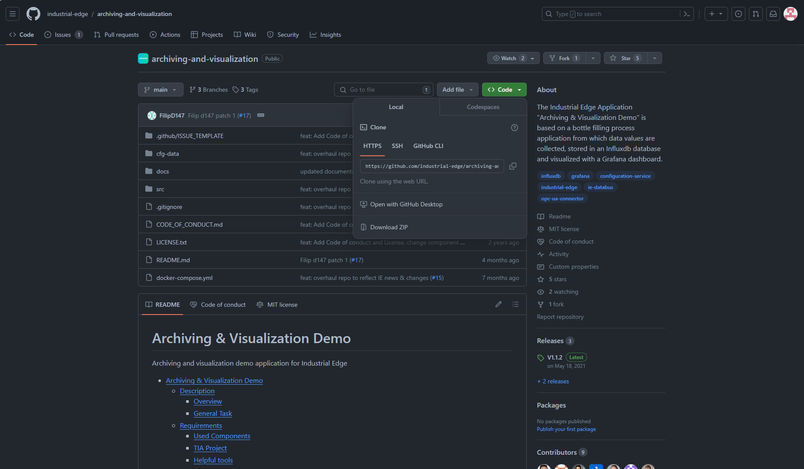

# Installation

- [Installation](#installation)
  - [Build application](#build-application)
    - [Download Repository](#download-repository)
    - [Build docker image](#build-docker-image)
  - [Upload Application to Industrial Edge Management](#upload-application-to-industrial-edge-management)
    - [Connect your Industrial Edge App Publisher](#connect-your-industrial-edge-app-publisher)
    - [Create new Application in Industrial Edge Management](#create-new-application-in-industrial-edge-management)
    - [Configure Databus and OPC UA Connector](#configure-databus-and-opc-ua-connector)
    - [Add Edge App configuration \& upload configuration file to Industrial Edge Management](#add-edge-app-configuration--upload-configuration-file-to-industrial-edge-management)
      - [MQTT](#mqtt)
      - [InfluxDB](#influxdb)
      - [Add Configuration to application](#add-configuration-to-application)
  - [Install Application on Industrial Edge Device](#install-application-on-industrial-edge-device)
    - [Edge App configuration](#edge-app-configuration)
      - [Databus](#databus)
      - [User](#user)
      - [Connector Configuration (OPC UA Connector)](#connector-configuration-opc-ua-connector)
      - [InfluxDB](#influxdb-1)
    - [Install Edge App](#install-edge-app)
    - [Configure InfluxDB Dashboard](#configure-influxdb-dashboard)

## Build application

### Download Repository

Download or clone the repository source code to your workstation.  



* Trough terminal:
```bash
git clone https://github.com/industrial-edge/archiving-and-visualization.git
```

* Trough VSCode:  
<kbd>CTRL</kbd>+<kbd>&uarr; SHIFT</kbd>+<kbd>P</kbd> or <kbd>F1</kbd> to open VSCode's command pallette and type `git clone`:


### Build docker image

- Navigate into `src/influxdb` and `src/mqtt-service` and find the file named `Dockerfile.example`. The `Dockerfile.example` is an example Dockerfile that can be used to build the docker image(s) of the service(s) that runs in this application example. If you choose to use these, rename them to `Dockerfile` before proceeding
- Open a console in the root folder (where the `docker-compose` file is)
- Use the `docker compose build` (replaces the older `docker-compose build`) command to build the docker image of the service which is specified in the docker-compose.yml file.
- These Docker images can now be used to build your app with the Industrial Edge App Publisher
- `docker images` can be used to check for the images
 
## Upload Application to Industrial Edge Management

Please find below a short description how to publish your application in your IEM.

For more detailed information please see the section for [uploading apps to the IEM](https://github.com/industrial-edge/upload-app-to-industrial-edge-management).

### Connect your Industrial Edge App Publisher

- Connect your Industrial Edge App Publisher to your docker engine
- Connect your Industrial Edge App Publisher to your Industrial Edge Management

### Create new Application in Industrial Edge Management

1. Create a new Project or select a existing one
2. Create new Application
3. Import the [docker-compose](../docker-compose.yml) file using the **Import YAML** button   
  
***Warnings**   
`Build (Detail) (services >> mqtt-service >> build) is not supported`    
`Build (Detail) (services >> influxdb >> build) is not supported.`   
  are caused by the fact, that the docker-compose file defines build commands for local build of the application's docker image which are not supported by the Industrial Edge App Publisher and **can safely be ignored***

4. Click on `Review` and `Validate & Create`. When asked about the redirect URL, select the endpoint of the influxdb service:


- **Start Upload** to transfer the app to Industrial Edge Management
- Further information about using the Industrial Edge App Publisher can be found in the [IE Hub](https://iehub.eu1.edge.siemens.cloud/documents/appPublisher/en/start.html)

---

### Configure Databus and OPC UA Connector  

1. Configure a user with password in the Databus for the OPC UA Connector and the Archiving & Operation Application for publishing and subscribing to topics on the Databus.
  
   ```txt
   User name: edge 
   Password: edge 
   Topic: ie/# 
   Permission: Publish and Subscribe
   ```


1. Open OPC UA Connector from your Industrial Edge Management and add the PLC as a data source. You are free to choose whichever name for datasource you like, but take a note of the name as you would need to specify the same name in the configuration of the app during its installation.

2. Add variables to collect data from PLC as described in [pre-requisites section](../README.md#prerequisite)
Select following Datapoints using the Browse functionality:

* GDB.signals.tankSignals.actLevel - (Read/100ms)
* GDB.signals.tankSignals.actTemperature - (Read/100ms)
* GDB.process.numberProduced - (Read/100ms)
* GDB.process.numberFaulty - (Read/100ms)
* GDB.hmiSignals.HMI.Nextbottle - (Read&Write/100ms)

<details>
  <summary>
    In case of browse timeout you can also add the tags manually
<small><i>Click to show/collapse.</i></small>
  </summary>

* `n=3;s="GDB"."signals"."tankSignals"."actLevel"`
* `n=3;s="GDB"."signals"."tankSignals"."actTemperature"`  
* `n=3;s="GDB"."process"."numberProduced"` 
* `n=3;s="GDB"."process"."numberFaulty"`
* `n=3;s="GDB"."hmiSignals"."HMI"."NextBottle"`

</details>   


3. Enter Databus credentials <br>

<a href="graphics/opc-ua-connector-bulk.png"></a>
<br>

### Add Edge App configuration & upload configuration file to Industrial Edge Management

The MQTT Service can be configured with a form. The form is based on JSONForms. If no configuration is provided during app installation, the application uses default values seen in the following json-file `config-default.json`:

```json
{
    "MQTT": {
        "HOST": "ie-databus",
        "PORT": "1883",
        "USERNAME": "edge",
        "PASSWORD": "edge",
        "TOPIC_NAME": "ie/d/j/simatic/v1/opcuac1/dp",
        "METADATA_TOPIC_NAME": "ie/m/j/simatic/v1/opcuac1/dp",
        "DATA_SOURCE_NAME": "Tank"
    },
    "INFLUXDB": {
        "HOST": "http://influxdb:8086",
        "PORT": "8086",
        "ORG": "edge",
        "BUCKET": "databus_values",
        "TOKEN": "industrialedge"
    }
}
```
#### MQTT

- HOST: This is the service name of the Databus
- PORT: This is the port of the Databus
- USER, PASSWORD: The user and password are configured in the Databus and used in the OPC UA Connector for accessing (publish, subscribe) to topics on the Databus
- TOPIC_NAME: This is the default topic root path for data of the OPC UA Connector
- METADATA_TOPIC_NAME: This is the default topic root path for metadata of the OPC UA Connector
- DATA_SOURCE_NAME The data source Name is configured in the OPC UA Connector. Insert here the data source Name for your PLC-Connection

#### InfluxDB

- HOST: Service name of InfluxDB which is specified in docker-compose. Do not change unless you are trying to connect to a different instance of influxdb. 
- PORT: Port on which the InfluxDB service is running. Do not change unless you are trying to connect to a different instance of influxdb. 
- ORG: Initial organization created in the Influxdb upon creation. This value needs to correspond to the value set in `docker-compose.yml` file.
- BUCKET: InfluxDB can have multiple database running in the same instance. Data which are collected from databus are written to that database. This value needs to correspond to the value set in `docker-compose.yml` file.
- TOKEN: Administrator token used for authorization of your app in order to bootstrap the app and read and write data to the database. This value needs to correspond to the value set in `docker-compose.yml` file.

#### Add Configuration to application
1. Go to IE Publisher and select the newly created application. Then click the "+ Configurations" button.


2. Add new configuration and enter all required fields:

   ```txt
   Display Name: Configuration
   Description: JSONForms Configuration
   Host Path: ./cfg-data/
   Add Template 
   - Name: JSONForms
   - Description: JSONForms Configuration
   - JSON Schema: set checkbox
   ```

In the final step, add the file /cfg-data/config.json as a template file. This template was created with JSON Schema. To find out how to create your own template check out the [IEM Operations Documentation](https://support.industry.siemens.com/cs/ww/en/view/109814453).


## Install Application on Industrial Edge Device

### Edge App configuration

Fill out Input-Form and select checkbox (check box green)


#### Databus

- MQTT Broker IP: optional
- PORT: optional

#### User

- Username: required
- Password: required

#### Connector Configuration (OPC UA Connector)

- Data Source Name: required
- Connector Metadata Topic: optional

#### InfluxDB

- InfluxDB IP: optional
- InfluxDB Port: optional
- Bucket Name: optional
- Organization: optional
- Token: optional


### Install Edge App

Install Edge Application to Industrial Edge Device and select app configuration


---

### Configure InfluxDB Dashboard

1. Open Industrial Edge Device in Browser and open installed application
2. Login to InfluxDB UI using the credentials set in docker-compose.yml, by default:  
   Username: **root**  
   Password: **changeMe1!**  
3. InfluxDB Welcome Page: Open Dashboards from the left menu
4. Click "+ Create Dashboards" button
5. Select "Import Dashboard"
6. Select the file located in `/src/influxdb/Dashboards/bottle_line_visualization.json` and click on "Import JSON as Dashboard"
7. Open the newly imported Dashboard by clicking on "Bottle Line Visualization"

> **Note**  
> Upon creation the Dashboard will show no data. It may take a moment before enough data coming from the Databus will be stored in the influxDB database and subsequently before it can be plotted in the provided dashboard.

