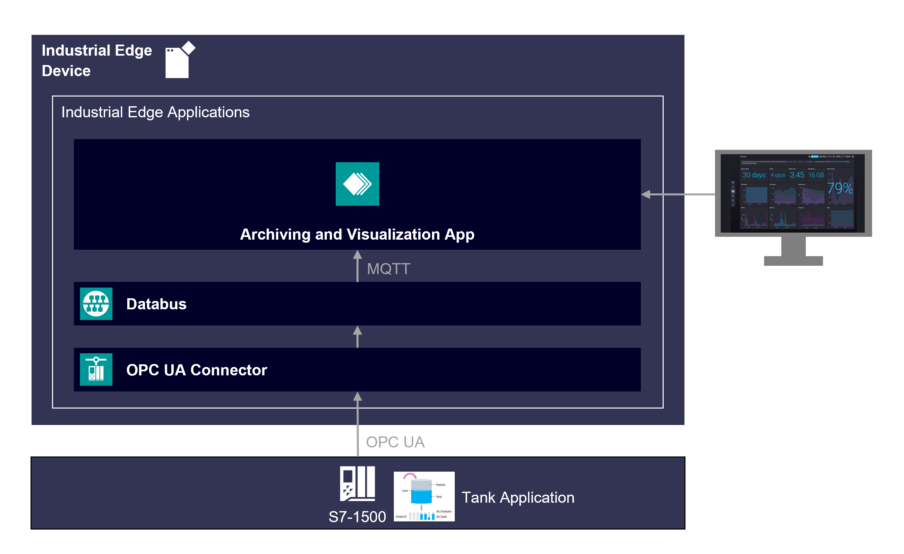

# Application overview

The Industrial Edge Application "Archiving & Visualization" is based on a bottle filling process application from which data values are collected, stored in an Influxdb database and visualized in a InfluxDB dashboard.

- [Application overview](#application-overview)
  - [General Task](#general-task)
  - [Application Architecture](#application-architecture)
  - [MQTT Service](#mqtt-service)
  - [InfluxDB Service](#influxdb-service)

## General Task

The Industrial Edge Application "Archiving & Visualization" collects data from an S7-1500 PLC using the OPC UA Connector Application. The collected data is automatically published to the Databus which is an internal MQTT broker of the Edge Runtime. The Application uses an MQTT Client (data-collector) to subscribe to the Databus and write these values into an Influx-Database. The time series of the collected data can then be plotted with InfluxDB dashboards.

## Application Architecture

The Industrial Edge Application "Archiving & Visualization" is using the microservice architecture. The application is separated in two independent components which performs independent tasks.

## MQTT Service

The "MQTT Service" handles all communication tasks to the Industrial Edge System Application - Databus. The service uses a MQTT-client to subscribe to MQTT-topics on the Databus to read the values published by the OPC UA Connector. The values are forwarded using http to the "InfluxDB Service".

## InfluxDB Service

The "InfluxDB Service" implements InfluxDB - an open source time series database to archive the recorded data. The InfluxDB provides a RESTful web API based on http for storing and accessing data inside the database.

The InfluxDB Service also serves as a visualization tool for the data received from PLC. It provides charts, graph and alerts and can connect to various supported data sources.
